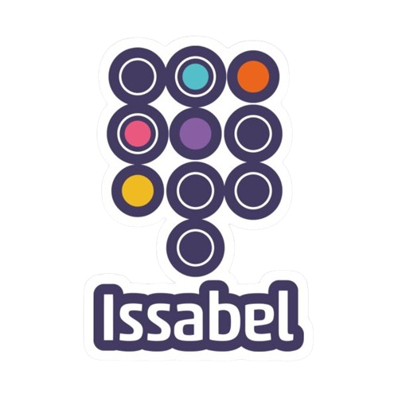

# Asterisk
#  Mise en place et sécurisation d’une plateforme VoIP basée sur la solution open source Asterisk en utilisant issabel

## Introduction
Asterisk est une solution de téléphonie open source très populaire qui permet aux entreprises de mettre en place des systèmes de communication professionnels avancés. Asterisk est un logiciel de PBX open source très populaire utilisé pour mettre en place des systèmes de communication vocale sur IP (VoIP).

in out project  we used Issabel For the implementation of Asterisk 
**IssabelPBX is an opensource GUI (graphical user interface) that controls and manages Asterisk (PBX).**

  

## Objectif 
La mise en place d’une solution de VoIP sécurisée basée sur des outils open source(**issabel**), précisément le serveur Asterisk et le softphone Zoiper. Les entreprises, bénéficiant d’une solution, une plateforme de VoIP assez flexible, peu couteuse, et protégée contre les attaques de sécurité de l’intérieur du réseau comme de l’extérieur aussi.
## Realisation 
In this [PDF](project.pdf) , you will find the complete Hull project. Below is an overview of its contents.

**1. Installation et configuration du serveur Asterisk** 
  - a. Installation d’Asterisk  
  - b. Configuration d’Asterisk   

**2. Configuration de la VoIP** 
  - a. Configuration des trunks SIP   
  - b. Installation et configuration des softphone (ZOIPER)   
  - c. Mise en place des numéros de téléphone(extension)   
  - d. Configuration des règles de routage   

**3. Test et Validation de la plateforme VOIP** 
  - a. Tests fonctionnels    
  - b. Vérification de la qualité des appels  

**4. Mise en œuvre des attaques contre le réseau VoIP** 
  - a. Localisation des serveurs VoIP   
  - b. Arp poisoning VOIP   
  - c. Interception d’appels entrants : Capture du trafic et écoute clandestine en utilisant Wireshark   
  - d. Déni de services : Dos et DDos   
  - e. Attaque sur l’authentification SIP   
  - f. Capture de l’authentification SIP en utilisant Sipdum   
     - i. Crack de la réponse d’authentification SIP   

**5. Mise en œuvre des solutions de sécurité** 
  - a. VOIP Hardening : Implémentation des bonnes pratiques   
  - b. Mise en place des IDS(snort)   
  - c. Configuration Firewall : Iptables, ufw   
  - d. Implémenter des solutions pour la mise en place QoS VoIP.   
  - e. Implémentation des protocoles sécurisée VoIP VPN  
## Team
- [Hajar Ed-darrajy](https://github.com/haizy1) Author
- [Imane Chaik](https://github.com/rivenos) 
